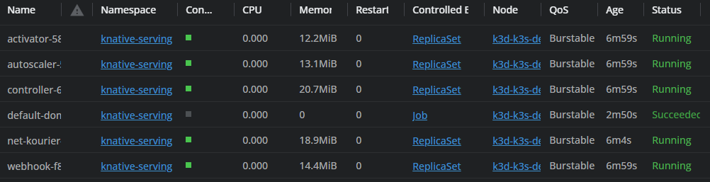
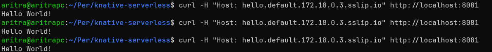
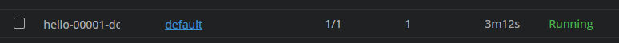
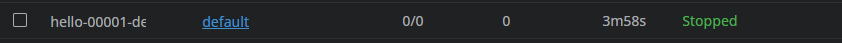
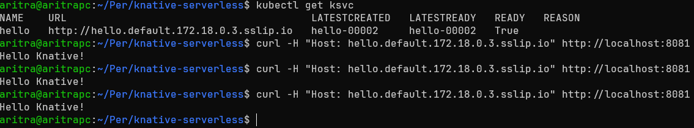
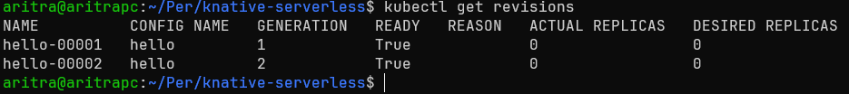
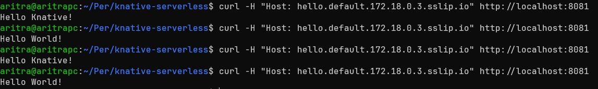

# Knative Serverless Application

This is the answer to exercise `5.6`

## Creation of Cluster

> For this exercise, the cluster was created using `k3d`

For Knative to work in k3d, a cluster was created with Traefik disabled.

```shell
k3d cluster create --port 8082:30080@agent:0 -p 8081:80@loadbalancer --agents 2 --k3s-arg "--disable=traefik@server:0"
```

## Deploying a Knative Service

Following the all the steps of [docs to Install Knative Serving](https://knative.dev/docs/install/yaml-install/serving/install-serving-with-yaml/), the pods were successfully running in the `knative-serving` namespace.



After this, by running `kubectl apply -f hello.yaml` we get the `hello` service running. It returns "Hello World!" when curl-ed.



## Autoscaling

When requests are constant to the host there is always 1 replica as seen in the screenshot of the deployment below.



If requests stop being sent, the deployment autoscales the replicas to 0



## Traffic Split

There was a change which was changing the `TARGET` env variable to `"Knative"`.



Another revision was created by applying the `hello.yaml` file. It gets a name of `hello-00002` and Generation 2.




Now the below block was added to `hello.yaml` to split the incoming traffic 50% to the latest revision and and the remaining 50% to `hello-00001`

```yaml
traffic:
  - latestRevision: true
    percent: 50
  - latestRevision: false
    percent: 50
    revisionName: hello-00001
```

Now half the requests return "Hello World!" and the other half returns "Hello Knative!"


